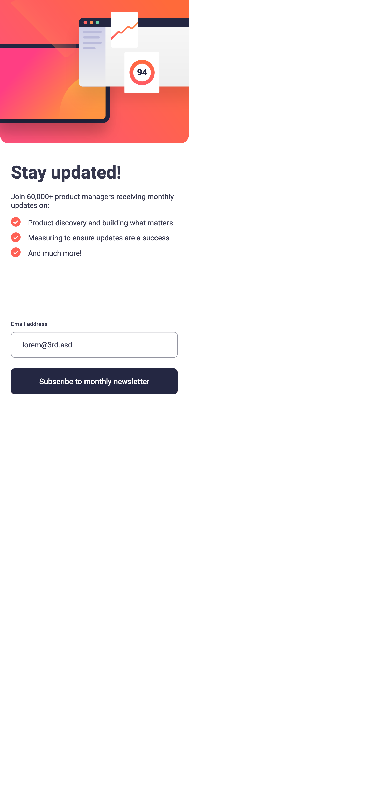
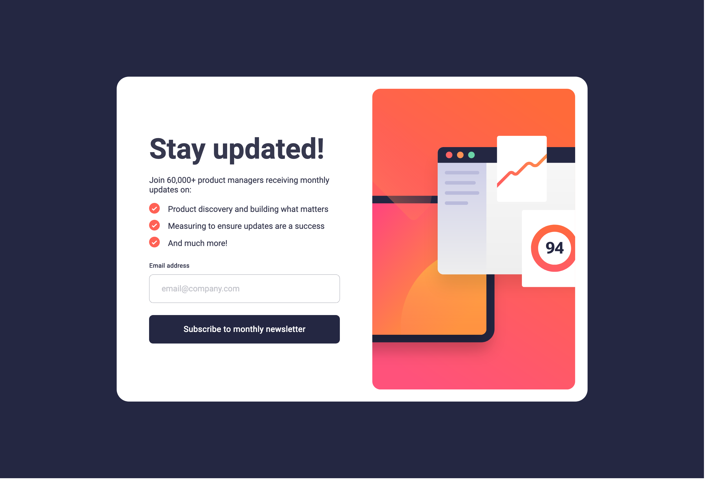
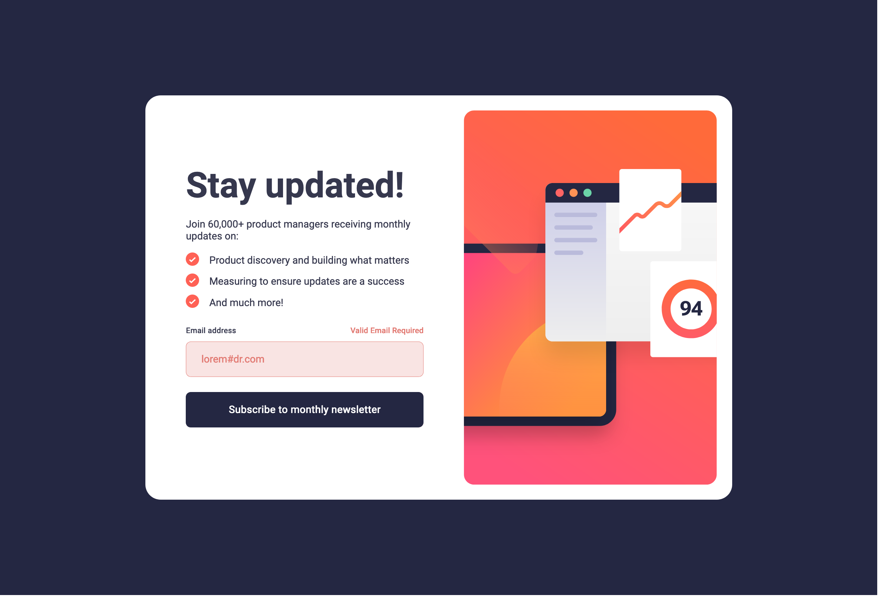
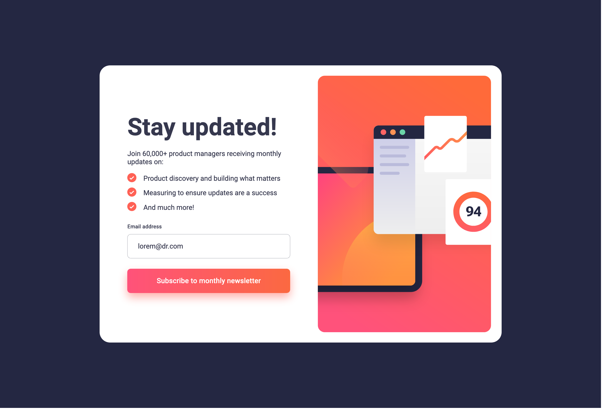
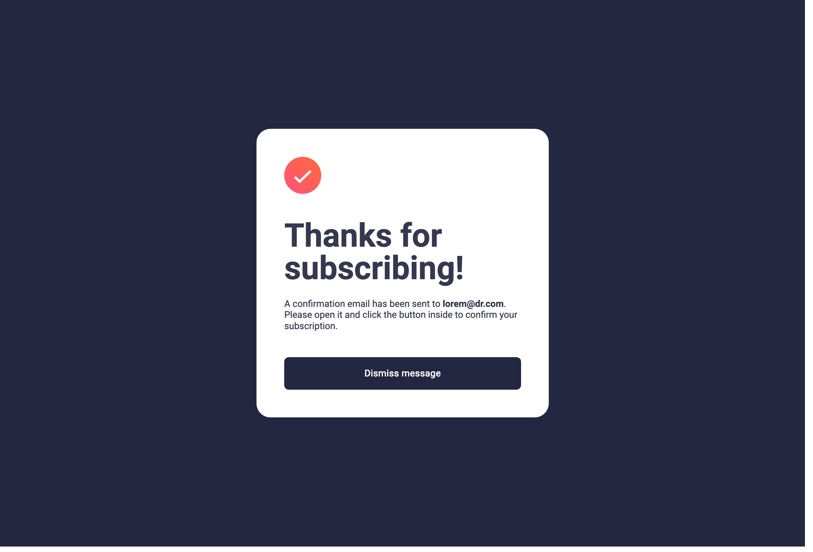

# Frontend Mentor - Newsletter sign-up form with success message solution

This is a solution to the [Newsletter sign-up form with success message challenge on Frontend Mentor](https://www.frontendmentor.io/challenges/newsletter-signup-form-with-success-message-3FC1AZbNrv). Frontend Mentor challenges help you improve your coding skills by building realistic projects. 

## Table of contents

- [Frontend Mentor - Newsletter sign-up form with success message solution](#frontend-mentor---newsletter-sign-up-form-with-success-message-solution)
  - [Table of contents](#table-of-contents)
  - [Overview](#overview)
    - [The challenge](#the-challenge)
    - [Screenshot](#screenshot)
    - [Links](#links)
  - [My process](#my-process)
    - [Built with](#built-with)
    - [What I learned](#what-i-learned)
    - [Continued development](#continued-development)
  - [Author](#author)

## Overview

### The challenge

Users should be able to:

- Add their email and submit the form
- See a success message with their email after successfully submitting the form
- See form validation messages if:
  - The field is left empty
  - The email address is not formatted correctly
- View the optimal layout for the interface depending on their device's screen size
- See hover and focus states for all interactive elements on the page

### Screenshot

### Links

- Solution URL: [click here](https://github.com/heylakshya/Frontend-Challenges/tree/main/newsletter-sign-up-with-success-message-main)
- Live Site URL: [click here](https://heylakshya.github.io/Frontend-Challenges/newsletter-sign-up-with-success-message-main/index.html)

## My process

### Built with

HTML, SASS, JS

### What I learned

- GET requests
- HTML forms attributes like action, name, for, value, type
- user input validation
- regex
- URL parameter parsing in JS
- use figma to estimate sizes and colors

### Continued development

- speed of dev

## Author

- Website - [Lakshya](https://www.lakshya.design)
- Frontend Mentor - [@heylakshya](https://www.frontendmentor.io/profile/heylakshya)
