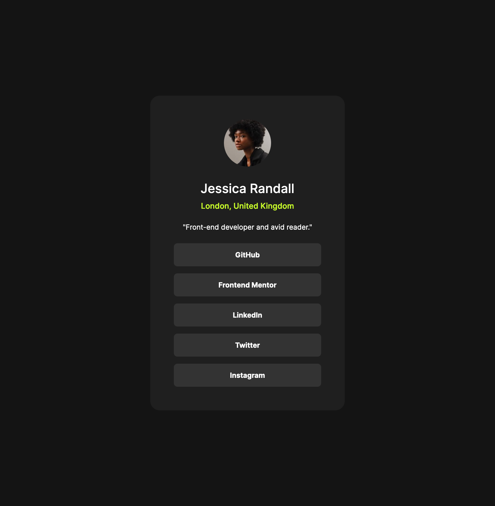

# Frontend Mentor - Social links profile solution

This is a solution to the [Social links profile challenge on Frontend Mentor](https://www.frontendmentor.io/challenges/social-links-profile-UG32l9m6dQ). Frontend Mentor challenges help you improve your coding skills by building realistic projects. 

## Table of contents

- [Frontend Mentor - Social links profile solution](#frontend-mentor---social-links-profile-solution)
  - [Table of contents](#table-of-contents)
  - [Overview](#overview)
    - [The challenge](#the-challenge)
    - [Screenshot](#screenshot)
    - [Links](#links)
  - [My process](#my-process)
    - [Built with](#built-with)
    - [What I learned](#what-i-learned)
    - [Continued development](#continued-development)
    - [Useful resources](#useful-resources)
  - [Author](#author)


## Overview

### The challenge

Users should be able to:

- See hover and focus states for all interactive elements on the page

### Screenshot



### Links

- Solution URL: [Add solution URL here](https://github.com/heylakshya/Frontend-Challenges/tree/ea744cfe4ca62f5acb1a68440cf929e8446a9dd7/social-links-profile-main)

## My process

### Built with

- Semantic HTML5 markup
- CSS custom properties
- Flexbox
- Mobile-first workflow

### What I learned

```css
@font-face {
    font-family: "Inter";
    src: url(../assets/fonts/Inter-VariableFont_slnt\,wght.ttf);
}
```

### Continued development

CSS at-rule to include fonts

### Useful resources

- [Emmet](https://docs.emmet.io/cheat-sheet/) - This helped me code more efficiently

## Author

- Website - [Lakshya](https://www.lakshya.design)
- Frontend Mentor - [@heylakshya](https://www.frontendmentor.io/profile/heylakshya)